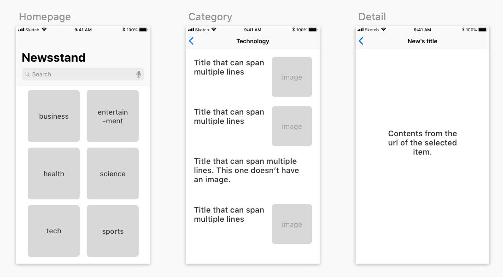

# Take Home Project No.1

## Introduction

Some companies send take home projects to candidates. This is common for small to medium companies and startups.

Take home projects are an opportunity for candidates to demonstrate skills when it comes to making decisions based on instructions or features that need to be build, while also demonstrating coding ability: how they decide to structure code, wether they used external libraries, preferred method of building UI, etc.

Without the pressure of a timed challenge, these mini projects are a great way to do a more accurate work sample.

## Description

The app you'll be making is a news app. It will fetch articles from recent news and display them as clickable items that will take you to the full story.

## Requirements
1. Follow the structure shown in the wireframe.
1. The first screen of the app shows available categories to choose what kind of news the user wants to browse.
1. Once the user selects a category, you show them a list of the top news. These results will each be a clickable item. When tapped, you'll open the full story from the original source.
1. The user can go back to the categories screen to keep exploring.
1. You'll need to use the News API https://newsapi.org and get an api key.
1. You should not use a third party library
1. Code must be on Github

## Stretch challenge
Add a search bar in the main screen. Instead of choosing a category, users can directly search news using a keyword.

## Resources
Additional resources that will help with this project, or that can be used as reference.

1. https://newsapi.org/docs
