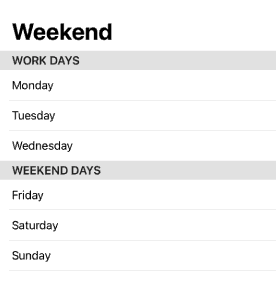

<!-- .slide: data-background="./Images/header.svg" data-background-repeat="none" data-background-size="40% 40%" data-background-position="center 10%" class="header" -->
# SwiftUI Pt. 2

<!-- Put a link to the slides so that students can find them -->

➡️ [**Slides**](https://make-school-courses.github.io/MOB-2.9-Technical-Seminar-MOB/Slides/Lesson2/Lesson2.html ':ignore')
<!-- > -->

## Learning Objectives

1. Create Lists using the `ForEach` loop
1. Create a tab bar based app structure
1. Create an app with SwiftUI + Combine + MVVM
1. Create UML diagrams

<!-- > -->

## Lists

Starting simple, with a static list

```swift
List {
  Text("Friday")
  Text("Saturday")
  Text("Sunday")
}
```

<!-- v -->

Wrapping it in a NavigationView

```swift
NavigationView{
  List {
    Text("Friday")
    Text("Saturday")
    Text("Sunday")
  }
  .navigationTitle("Weekend")
}
```

<!-- v -->

Add a struct to handle data:

```swift
struct WeekDay: Identifiable {
    var id: String { name }
    var name: String
}
```

<!-- v -->

Use structs instead of static data.

```swift
let days = [WeekDay(name: "Friday"), WeekDay(name: "Saturday"), WeekDay(name: "Sunday")]
var body: some View {
    NavigationView{
      List {
        ForEach(days){ dayName in
            Text(dayName.name)
        }
      }
      .navigationTitle("Weekend")
    }
}
```

<!-- > -->

## Challenge

Add the next struct:

```swift
struct WeekSection: Identifiable {
    var id: String { name }
    var name: String
    var days: [WeekDay]
}
```

and change your data to be:
```swift
let weekSections = [WeekSection(name: "Work days", days:[WeekDay(name: "Monday"), WeekDay(name: "Tuesday"), WeekDay(name: "Wednesday")]), WeekSection(name: "Weekend days", days:[WeekDay(name: "Friday"), WeekDay(name: "Saturday"), WeekDay(name: "Sunday")])]
```

<!-- v -->

Create the following variation:



Look into [Section](https://developer.apple.com/documentation/swiftui/section)

<!-- > -->

## Creating a tab bar

Follow this video:

<iframe src="https://youtube.com/embed/Ck7uN5ZKzf8?t=71" data-autoplay  width="700" height="500"></iframe>

<!-- > -->

## SwiftUI + Combine + MVVM

First a review:

- What do you know about MVVM?
- What do you know about Combine?

Add your answers [here](https://jamboard.google.com/d/1vba5Z04ar9lVVb_M_9F9gasBIS3j0eGu046MdbcTLGQ/edit?usp=sharing)

<!-- > -->

Tutorial Overview

- questions
- clarifications
- review of changes

<!-- > -->

## Diagraming an architecture

It's important to know how to read and create UML diagrams. Specially if you expect other developers to collaborate with your codebase or if you are being introduced to a new project.

**Create a UML diagram of the Weather app** (The first View only). Make it as detailed as possible, imagine you'll use this to present at the next team meeting and there are people new to the project. 😎

Send it to the slack channel.

<!-- v -->

[How to draw class diagrams](https://creately.com/blog/diagrams/class-diagram-tutorial/#Definition)

<!-- > -->

## Additional Resources

1. [Lists with SwiftUI](https://www.hackingwithswift.com/quick-start/swiftui/building-a-menu-using-list)
