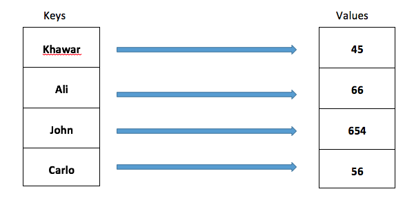
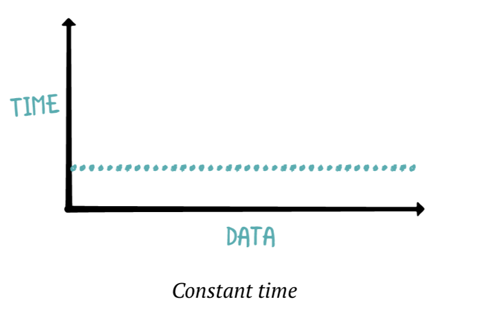
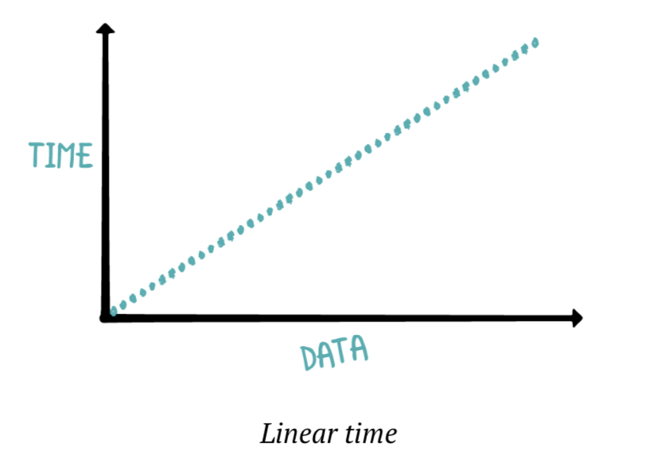
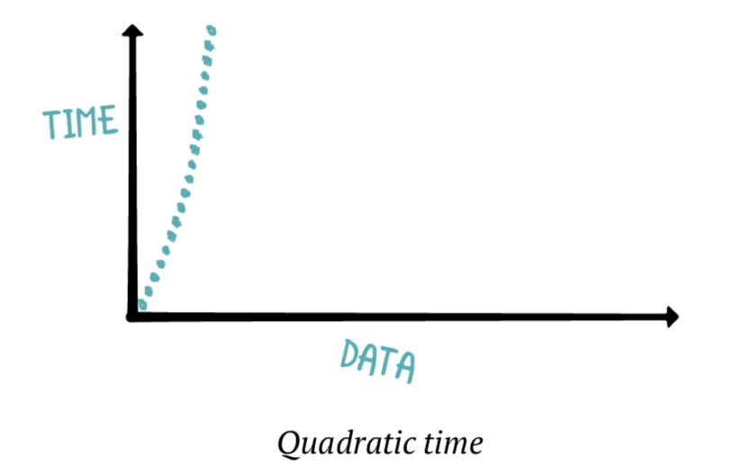
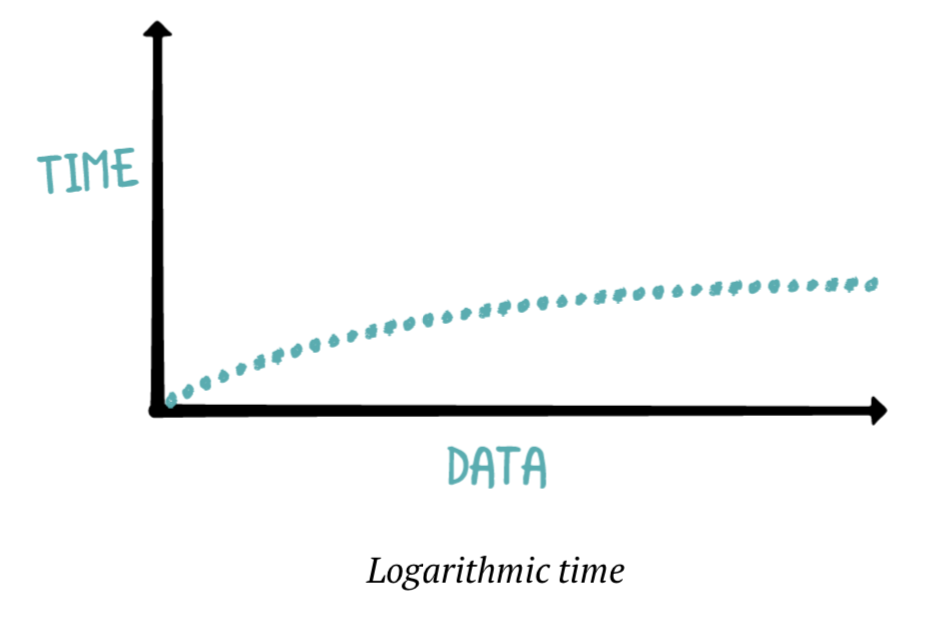
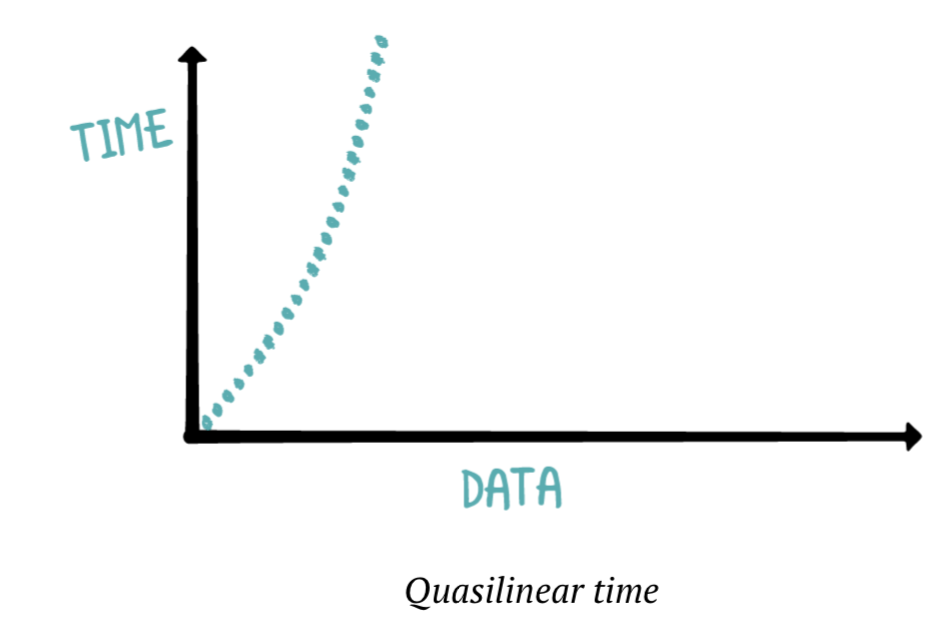

<!-- .slide: data-background="./Images/header.svg" data-background-repeat="none" data-background-size="40% 40%" data-background-position="center 10%" class="header" -->
# Arrays, Dictionaries, and Complexity Analysis

<!-- Put a link to the slides so that students can find them -->

<!-- pg 27 -->

➡️ [**Slides**](/MOB-2.9-Technical-Seminar-MOB/Slides/arrays-dict-complex.html ':ignore')

<!-- > -->

## Learning Outcomes

By the end of this lesson, you should be able to...

1. Review how arrays and dictionaries are used in swift and their methods
1. Review the major time complexities and how to recognize them
1. Review how to calculate space complexity
1. Practice interview questions that use arrays and/or dictionaries, and provide their time and space complexities

<!-- > -->

## Arrays


**Arrays** are a way to store a comma-separted list of values. We use square brackets `[ ]` to denoate an array:

```swift
let food = ["hamburgers", "bananas", "noodles"]
```

<!-- v -->

### Array Factoids

- Arrays are **sequences**, which means they can be iterated at least once through.
- They are also **collections**, meaning they can be traversed non-destructively mutliple times, and have access operators.
- They are one of the fundamental building blocks used to make other data structures
- Considered **random-access** because can **retrieve items in cosntant time**
- The `append` method is constant time, whereas the `insert` method is linear
    - Movie theater line: easy to add someone to the end of the line (no one else moves), but if your friend joins in the middle, everyone else needs to shift
- Each time an array runs out of storage and needs to copy, it _doubles_ its capacity.

<!-- v -->

### Pass by Value

**Arrays are pass by value, NOT reference.**

This means that when an array is assigned to a variable, passed as argument to a function or method, or otherwise moved around, a _copy_ of it is actually created and assigned or passed. The original is unaffected

<!-- > -->

## Dictionaries


_[Source](https://www.c-sharpcorner.com/article/dictionaries-in-swift-programming-language/)_

**Dictionaries** are data structures that hold Key/Value pairs. In the example above, `"Ali"` is the key, and `66` is the value. An example of a dictionary using Swift syntax is below:

```swift
var scores: [String: Int] = ["Erica": 9, "Mary": 12, "Wayne": 1]
```

<!-- v -->

### Dictionary Factoids

- Dictionaries make no guarantee of order, or insertion at a specific index
- Insertion and lookup are constant time operations
- Like arrays, **dictionaries also are pass by value, NOT reference.**

<!-- > -->

## Time Complexity

 _[Source](https://www.hackerearth.com/practice/notes/big-o-cheatsheet-series-data-structures-and-algorithms-with-thier-complexities-1/)_

There are 5 common time complexities: 

- Constant
- Linear
- Quadratic
- Log
- Quasilinear 

<!-- v -->

### Constant


_Source: Data Structures and Algorithms in Swift v2.0_

Something takes **constant time if changing the input size doesnt change the length of time to complete the function**.

For example, appending to an array takes the same amount of time whether the array has 0 or 10,000 items.

<!-- v -->

### Linear


_Source: Data Structures and Algorithms in Swift v2.0_

Something takes **linear time if time scales equally with the input size**

For example, if a function is using a `for` or `while` loop to iterate over all items in an input array, as the size of the input array grows, the function completion time will also equally grow, as one extra step is added for each item in the array

<!-- v -->

### Quadratic


_Source: Data Structures and Algorithms in Swift v2.0_

Something takes **quadratic time if time increases in proportion to the square of the input size**

This is most commonly seen with nested loops. If you have a double nested for loop that looks at each item in an array, you need to iterate over each item in the array from start to finish for each item in the array

<!-- v -->

### Log


_Source: Data Structures and Algorithms in Swift v2.0_

An algorithm that takes **log time is one that can repeatedly drop half of the required comparisons**. 

Binary search is one of the best examples of this, as each iteration through the algorithm, the available input size is cut in half each time.

<!-- v -->

### Quasilinear


_Source: Data Structures and Algorithms in Swift v2.0_

Quasilinear performs worse than linear, but better than quadratic. It is represnted as _O(nlogn)_, or the **multiplication of linear and log time.**

Examples of this is Swift's built-in `sort` method, Merge Sort, Quick Sort, and Heap Sort. Generally speaking, many **Divide and COnquer** algorithms have quasilinear time complexity.

<!-- v -->

### Time Complexity Activity

Write two functions that take a positive integer `n` as input, and return the sum of numbers 1 to `n`.

1. The first function should take linear time
1. The second function should take constant time

<!-- > -->

## Space Complexity

**Space Complexity** is defined as a measure of the memory required for the algorithm to run. 

Take a look at this example from Data Structures and Algorithms in Swift v2.0:

```swift
func printSorted(_ array: [Int]) {
  let sorted = array.sorted()
  for element in sorted {
    print(element)
  }
}
```

Since `array.sorted()` will produce a brand new array with the same size of the input array, the space complexity of `printSorted` is `O(n)`.

**Stretch Challenge:** How do you improve this to have a constant time space complexity?

<!-- > -->

## Interview Question #1
Adapted from Toptal.com

Given the following code:

```swift
var array1 = [1, 2, 3, 4, 5]
var array2 = array1
array2.append(6)
var len = array1.count
```

**What’s the value of the `len` variable, and why?**

<!-- > -->

## Interview Question #2

**Implement Binary Search. Provide the time complexity as well.**

**Stretch challenge: provide the space complexity**

<!-- > -->

<!-- .slide: data-background="#087CB8" -->
## [**10m**] BREAK

<!-- > -->

## Interview Question #3

Adapted from Sean Allen

**Write a function that takes an array as input, and finds the most common element in the input array, as well as the number of times it appears. Provide the time complexity as well.**

Implementation Notes:

-  If all values are unique, it should return -1.
-  If multiple elements appear the highest number of times, the function should return all of the elements that have the max frequency
    -  example:`["red, "blue", "green", "red", "yellow", "blue"]` should return `["red", 2, "blue", 2]`

**Stretch challenge: provide the space complexity**

<!-- > -->

## Interview Question #4

**Write a funcion that takes in an unsorted integer array containing “n” numbers ranging from 0 to n-2, where there is exactly one number repeated in the array. The function should find and return the duplicate number. Provide the time complexity as well.**

Example:

- Given an input array where `n = 5` looked like the following: `[0, 3, 1, 2, 3]`, then the function should return 3, as it is the duplicate.

**Stretch challenge: provide the space complexity**

<!-- > -->

## Stretch Challenge: Interview Question #5

**Given an array of integers, return indices of the two numbers such that they add up to a specific target. Provide the time complexity as well.**

You may assume that each input would have exactly one solution, and you may not use the same element twice. Your solution must use dictionaries.

Example:

- Given an input array `[2, 7, 11, 15]`, and a target of `9`, Because 2 + 7 = 9, the function would return `[0, 1]`

**Extra Stretch challenge: provide the space complexity**

<!-- > -->

## Wrap Up

 - Arrays and dictionaries are the foundational data structures that we build others off of
 - Constant, linear, quadratic, log, and quasilinear are the most common time complexities