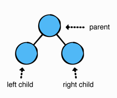
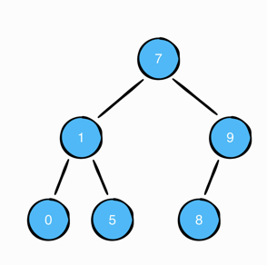

<!-- .slide: data-background="./Images/header.svg" data-background-repeat="none" data-background-size="40% 40%" data-background-position="center 10%" class="header" -->
# Binary Trees

<!-- Put a link to the slides so that students can find them -->

➡️ [**Slides**](/MOB-2.9-Technical-Seminar-MOB/Slides/binarytrees.html ':ignore')

<!-- > -->

## Learning Objectives

By the end of this lesson, you should be able to...

1. Review how to implement binary trees and their methods
1. Practice interview questions that use binary trees

<!-- > -->

## Binary tree

A tree un which each node has **at most two children**

Often referred to as *left* and *right* children.



<!-- > -->

## Implementation

Create a `BinaryNode` class and add:

- `value` property
- `leftChild` property
- `rightChild` property
- initializer

<!--
public class BinaryNode<Element> {

  public var value: Element
  public var leftChild: BinaryNode?
  public var rightChild: BinaryNode?

  public init(value: Element) {
    self.value = value
  }
}
-->

<!-- > -->

## An example

Create a tree that matches this graphical representation.



<!-- > -->

## Traversing the tree

**In-order traversal**

- Start at the root node.
- If the current node has a left child, recursively visit this child first.
- Then visit the node itself.
- If the current node has a right child, recursively visit this child.

**How does this look like graphically?** *On whiteboard*<br>
**What do you notice about this traversal?**
<!-- It prints the tree in ascending order-->

<!-- > -->

## Implement In-Order Traversal

Compare solutions and test results.

```swift
tree.traverseInOrder { print($0) }
```

<!--
public func traverseInOrder(visit: (Element) -> Void) {
    leftChild?.traverseInOrder(visit: visit)
    visit(value)
    rightChild?.traverseInOrder(visit: visit)
  }
-->

<!-- > -->

**Pre-order traversal**

- Always visits the current node first.
- Then recursively visits the left child.
- Then recursively visits the right child.

**How does this look like graphically?** *On whiteboard*<br>

<!-- > -->

## Implement Pre-Order Traversal

Compare solutions and test results.

```swift
tree.traversePreOrder { print($0) }
```

<!--
public func traversePreOrder(visit: (Element) -> Void) {
  visit(value)
  leftChild?.traversePreOrder(visit: visit)
  rightChild?.traversePreOrder(visit: visit)
}
-->

<!-- > -->

**Post-order traversal**

- Visits the left child recursively
- Visits the right child recursively
- Visits the current node

**How does this look like graphically?** *On whiteboard*<br>

<!-- > -->

## Implement Pre-Order Traversal

Compare solutions and test results.

```swift
tree.traversePostOrder { print($0) }
```

<!--
public func traversePostOrder(visit: (Element) -> Void) {
  leftChild?.traversePostOrder(visit: visit)
  rightChild?.traversePostOrder(visit: visit)
  visit(value)
}
-->

<!-- > -->

<!-- .slide: data-background="#087CB8" -->

## [**10m**] BREAK

<!-- > -->

## Interview Challenge #1 - from Data Structures and Algorithms in Swift

Given a binary tree, find the height of the tree. The height of the binary tree is determined by the distance between the root and the furthest leaf. The height of a binary tree with a single node is zero, since the single node is both the root and the furthest leaf.
