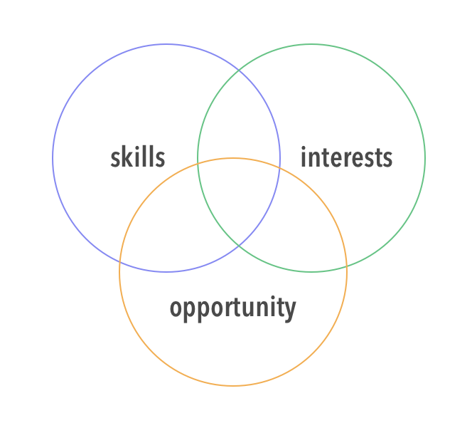

<!-- .slide: data-background="./Images/header.svg" data-background-repeat="none" data-background-size="40% 40%" data-background-position="center 10%" class="header" -->
# General Concepts

<!-- Put a link to the slides so that students can find them -->

➡️ [**Slides**](/MOB-2.9-Technical-Seminar-MOB/Slides/stacks.html ':ignore')

<!-- > -->

## Learning Objectives

By the end of this lesson, you should be able to...

1. Reflect on what concepts they feel strong about
1. Reflect on what concepts they know there's an area of opportunity
1. Discuss common concepts in iOS
1. Practice conceptual interview questions

<!-- > -->

## A reflection

You've been an iOS developer for over a year now at least. By now you know there are many stages one must go through and many areas in which you can specialize.

Take a moment to reflect on your journey so far and let's find what you could be focusing next.

In a mini whiteboard or a notebook, draw the following venn diagram.

It has three sections:

1. **Skills.** Here you write all of the skills you know you have up to now. It doesn't matter the level of the skills, you could be just learning it or something you master.

1. **Interests.** Here you write all of the topics in iOS that you are interested in. Interested to improve, to learn, to explore.

1. **Opportunity.** Here you write all of the areas of opportunity you can identify for yourself.

Then see if any two the areas match and ultimately, where the three intersect. This middle intersection would represent the most exciting option for you to pursue practicing.

When everyone is done, we share our result.

<!-- > -->

## Lightning rounds

Everyone with laptops closed 😯

What is Cocoa Touch?

The application development environment for building software programs to run on iOS, iPadOS, watchOS and tvOS.

What is the difference between Synchronous & Asynchronous task?
 

A synchronous task waits until the task is completed. An asynchronous task is done in the background and can send a notification when it's complete.

What is the difference between strong and weak references?

Strong means that the reference count will increase and
the reference to it will be maintained through the life of the object.
Weak means that we are pointing to an object but not increasing its reference count.

Why are completion handlers marked with <b>@escaping</b>?

Because they are executed some point after the enclosing function has been executed.

What are two ways to achieve concurrency in iOS?

Dispatch queues, Operation queues, handling threads manually.

Which is the application thread from where UIKit classes should be used?

The main thread.

What’s the difference between the frame and the bounds?

The bounds of a UIView is the rectangle, expressed as a location (x,y) and size (width, height) relative to its own coordinate system (0,0).
The frame of a UIView is the rectangle, expressed as a location (x,y) and size (width, height) relative to the superview it is contained within.

Why are design patterns important. Mention 2?

Are reusable solutions to common problems in software design. They’re templates designed to help you write code that’s easy to understand and reuse. Ex: Singleton, Observer, Chain of Responsibility, etc.

What are two ways in which Cocoa implements the observer pattern?

KVO, Notifications.

Explain MVC?

Explain MVVM?

What are some advantages of the Swift programming language?

Explain generics.

What is a lazy property?

How do you pass data between view controllers?

What is GCD (Grand Central Dispatch)?

What is a race condition?

Explain the guard statement.

What are the different ways to specify the layout of elements in UIView?

## Discussion rounds

Get in groups of 3, discuss the following questions and come up with a conclusion for each. Aim for up to 5 min per question. Make sure everyone participates in the discussion.

For each question, everyone gives their point of view and discuss over agreements and disagreements.

1. What is the best architecture for an iOS app?
1. What is the best persistence method to use in an app?
1. Best method to build the interface (UI) of an app?
1. How important is it to write unit and UI tests before submitting an app to the store?
1. How much of these concepts does an iOS dev need to know to get a job?

## Mock interviews

Being familiar with all of the concepts and also being able to discuss these topics gives us confidence with what we know and can do.

The more we practice speaking with the correct terminology, the easier  an interview will be.

We are going to do peer to peer mock interviews, they will be technical but not with a coding challenge.

As the interviewer ask the following questions.
1. Tell me about a project you're working on, or you most recent project.
  1. What is the most valuable thing you learned?
  1. What was a challenging aspect of the project?
  1. In what way does the project help you grow as an iOS developer?
1. Pick 3 questions from the Lightning Rounds. For each answer you get evaluate if the person is able to explain the concept and demonstrate solid understanding.
1. Give feedback to your peer.

As the person being interviewed:
1. Make sure you articulate your answers in a professional manner.
1. When talking about your projects make sure you explain the technical side of them.
1. It's ok to say you don't know an answer, you'll likely get another question.
1. Incorporate feedback in the end.

Each student will play both roles (twice?). Once a round has been made, you'll switch.

## Activity

Start the first take home project. Pay attention to how much time it takes you to complete all of it.

[Take home project 1](https://github.com/Make-School-Courses/MOB-2.9-Technical-Seminar-MOB/blob/master/Assignments/take-home-1.md)
