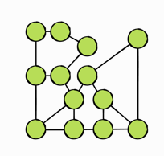

<!-- .slide: data-background="./Images/header.svg" data-background-repeat="none" data-background-size="40% 40%" data-background-position="center 10%" class="header" -->
# Graphs

<!-- Put a link to the slides so that students can find them -->

➡️ [**Slides**](/MOB-2.9-Technical-Seminar-MOB/Slides/graphs.html ':ignore')

<!-- > -->

## Learning Objectives

By the end of this lesson, you should be able to...

1. Review how to implement graph algorithms
1. Practice interview questions with graphs

<!-- > -->

## Graph

- Data structure that captures a relationship between object.
- Made up of **vertices** connected by **edges**

<!-- > -->

## Weighted graphs

In a weighted graph, every edge has a weight associated with it. This is the **cost** of using that edge.

- Can choose the cheapest or shortest path between two vertices.

**Airline industry example** Vertices can represent a state/country and edges the route from one place to another. Weight is the price of the flight.

<!-- > -->

## Directed graphs

- Graphs can have a direction.
- Makes them more restrictive to traverse.

**Airline industry example**

<!-- > -->

## Undirected graphs

- Two connected vertices have edges going back and forth.
- The weight of an edge applies to both directions.

<!-- > -->

## Getting familiar with the source sode

- Follow source code to identify common operations in Graphs.
- Identify properties in a vertex. Why make it Hashable and Equatable?
- Identify properties in an edge.

<!-- > -->

## An adjacency list

For every vertex in the graph, the graph stores a list of outgoing edges.

**Airline industry example (whiteboard)**

What can we learn with the list?

<!-- > -->

## Implement the adjacency list

Follow the protocol stubs in the file.

Then build the graph and print the adjacency list for the Airline example.

<!-- > -->

## [**10m**] BREAK

<!-- > -->

## Interview Challenge #1 - from Data Structures and Algorithms in Swift

Vincent has three friends, Chesley, Ruiz and Patrick. Ruiz has friends as well: Ray, Sun, and a mutual friend of Vincent’s. Patrick is friends with Cole and Kerry. Cole is friends with Ruiz and Vincent.

Create an adjacency list that represents this friendship graph. Which mutual friend do Ruiz and Vincent share?
