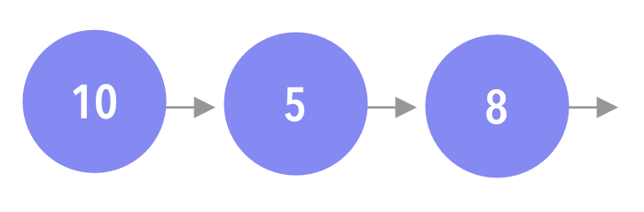

<!-- .slide: data-background="./Images/header.svg" data-background-repeat="none" data-background-size="40% 40%" data-background-position="center 10%" class="header" -->
# Linked Lists

<!-- Put a link to the slides so that students can find them -->

➡️ [**Slides**](/MOB-2.9-Technical-Seminar-MOB/Slides/linked-lists.html ':ignore')

<!-- > -->

## Learning Objectives

By the end of this lesson, you should be able to...

1. Review how to implement linked lists and their methods
1. Practice interview questions that use linked lists

<!-- > -->

## Linked List

A collection of values arranged in a linear sequence.



<!-- > -->

A linked list is a chain of nodes. Every **node** has 2 responsibilities:

- Hold a value
- Hold a reference to the next node.

A **nil** value represents the end of the list.

<!-- v -->

Open a new playground and add a new file: **Node.swift**

```swift
public class Node<T> {
    public var value: T
    public var next: Node?

    public init(value: T, next: Node? = nil) {
        self.value = value
        self.next = next
    }
}
```

<!-- v -->

Include this helper extension to print it to console.

```swift
extension Node: CustomStringConvertible {
    public var description: String {
        guard let next = next else {
            return "\(value)"
        }
        return "\(value) -> " + String(describing: next) + " "
    }
}
```
<!-- > -->

## Creating the linked list

Create a new file **LinkedList.swift**

```swift
public struct LinkedList<T> {

  public var head: Node<T>?
  public var tail: Node<T>?

  public init() {}

  public var isEmpty: Bool {
    return head == nil
  }
}
```

<!-- v -->
Add the following helper extension to print the list in console.

```swift
extension LinkedList: CustomStringConvertible {

  public var description: String {
    guard let head = head else {
      return "Empty list"
    }
    return String(describing: head)
  }
}
```

<!-- v -->

Adding values to the list:

- **push:** Adds a value at the beginning of the list
- **append:** Adds a value at the end of the list.
- **insert(after:):** Adds a value after a specific node.

<!-- v -->

## Push

Adding at the beginning of the list (head-first insertion).

```swift
public mutating func push(_ value: T) {
  head = Node(value: value, next: head)
  if tail == nil {
    tail = head //In case of an empty list
  }
}
```

<!-- v -->

## Append

Adds a value at the end of the list (tail-end insertion).

```swift
public mutating func append(_ value: T) {
    guard !isEmpty else {
      push(value)
      return
    }
    tail!.next = Node(value: value)
    tail = tail!.next
}
```

<!-- v -->

## Insert after

Inserts a value in a specific place in the list.

- First find the node
- Then insert the new node

```swift
public func node(at index: Int) -> Node<T>? {
    var currentNode = head
    var currentIndex = 0

    while currentNode != nil && currentIndex < index {
      currentNode = currentNode!.next
      currentIndex += 1
    }
  return currentNode
}
```

<!-- v -->

```swift
@discardableResult public mutating func insert(_ value: T, after node: Node<T>) -> Node<T> {
    guard tail !== node else {
      append(value)
      return tail!
    }
    node.next = Node(value: value, next: node.next)
    return node.next!
}
```

<!-- > -->

## Analysis

|       | push | append | insert after | node at |
|:-----:|:----:|:------:|:------------:|:-------:|
|action |      |        |              |         |
|time complexity |      |              |         |

<!-- > -->

## Activity in pairs

Add the removing operations in the linked list.

- **pop:** Removes the first node.
- **removeLast:** Removes the last node.
- **remove(at:):** Removes a value at a specific index

```swift
@discardableResult public mutating func pop() -> T? {

}

@discardableResult public mutating func removeLast() -> T? {

}

@discardableResult public mutating func remove(after node: Node<T>) -> T? {

}
```
<!--
Solution:
@discardableResult public mutating func pop() -> T? {
        defer {
            head = head?.next
            if isEmpty {
                tail = nil
            }
        }
        return head?.value
    }

    @discardableResult public mutating func removeLast() -> T? {
        guard let head = head else {
            return nil
        }
        guard head.next != nil else {
            return pop()
        }
        var prev = head
        var current = head
        while let next = current.next {
            prev = current
            current = next
        }
        prev.next = nil
        tail = prev
        return current.value
    }

    @discardableResult public mutating func remove(after node: Node<T>) -> T? {
      defer {
        if node.next === tail {
          tail = node
        }
        node.next = node.next?.next
      }
      return node.next?.value
    }
-->

<!-- > -->

## Analysis

|       | pop | removeLast | remove after |
|:-----:|:----:|:------:|:---------------:|
|action |      |        |                 |         
|time complexity |      |                 |         

<!-- > -->

<!-- .slide: data-background="#087CB8" -->
## [**10m**] BREAK

<!-- > -->

## Interview Challenge #1 - from Data Structures and Algorithms in Swift

Given a linked list as your input, write a function that prints the nodes in reverse order. You should not use recursion to solve this problem.


<!-- v -->

## Interview Challenge #2 - from Data Structures and Algorithms in Swift

Given a linked list, write a function that returns the middle node.

```
1 -> 2 -> 3 -> nil
// return 2

1 -> 2 -> 3 -> 4 -> nil
// return 3

```

<!-- v -->

## Interview Challenge #3 - from Data Structures and Algorithms in Swift

Write a function that takes 2 sorted linked lists and merges them into one.

```
1 -> 5 -> 8 -> 10
0 -> 2 -> 6 -> 11

//merges into

0 -> 1 -> 2 -> 5 -> 6 -> 8 -> 10 -> 11
```

<!-- v -->

## Interview Challenge #4 - from Data Structures and Algorithms in Swift

Write a function that removes all occurrences of a given element in a linked list.

```
1 -> 6 -> 8 -> 8 -> 4

// after removing all occurrences of 8
1 -> 6 -> 4
```

<!-- > -->

## Resources

Data Structures & Algorithms in Swift. By Matthijs Hollemans
