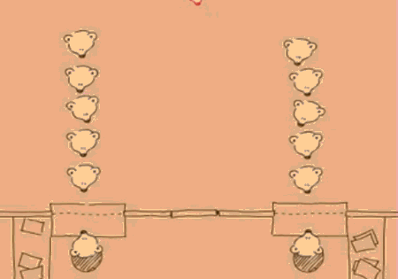

<!-- .slide: data-background="./Images/header.svg" data-background-repeat="none" data-background-size="40% 40%" data-background-position="center 10%" class="header" -->
# Queues

<!-- Put a link to the slides so that students can find them -->

➡️ [**Slides**](/MOB-2.9-Technical-Seminar-MOB/Slides/queues.html ':ignore')

<!-- > -->

## Learning Objectives

By the end of this lesson, you should be able to...

1. Review how to implement queues and their methods
1. Practice interview questions that use queues

<!-- > -->

## Queue



<!-- > -->

- Queues use **FIFO**. The first item added to the queue will be the first to be removed.

- Use queues when it's important to keep the ordering of elements to process later.

- Good for scheduling (data transfer, downloading files)-> Concurrency in iOS is achieved using queues.

<!-- > -->

We can create queues using arrays, stacks and linked lists. So we'll establish a protocol so that the queue implementation is available for all.

```swift
public protocol Queue {
  associatedtype Element
  mutating func enqueue(_ element: Element) -> Bool
  mutating func dequeue() -> Element?
  var isEmpty: Bool { get }
  var peek: Element? { get }
}
```

<!-- > -->

## Queue operations

- **enqueue:** Adds an element at the back of the queue. Returns true if it was successful.

- **dequeue:** Removes the element at the front of the queue and returns it.

- **isEmpty:** Checks if the queue is empty.

- **peek:** Returns the element at the front of the queue.

<!-- > -->

```swift
public struct QueueArray<T>: Queue {
    private var array: [T] = []
    public init() {}
    public var isEmpty: Bool {
        return array.isEmpty
    }
    public var peek: T? {
        return array.first
    }
    public mutating func enqueue(_ element: T) -> Bool {
        array.append(element)
        return true
    }
    public mutating func dequeue() -> T? {
        return isEmpty ? nil : array.removeFirst()
    }
}

extension QueueArray: CustomStringConvertible {
    public var description: String {
        return String(describing: array)
    }
}
```

<!-- > -->

Try it out

|   Queue  |
|:-----:|
|Mexico   |
|Peru |   
|Argentina |
|Colombia |

Then call dequeue.
Then peek.

<!-- > -->

## Analysis

|       | Best case | Worst case |
|:-----:|:----:|:------:|
|enqueue |       |               |   
| dequeue |      |              |   
| space |        |              |   

<!-- > -->

- What are the benefits of the array implementation?
- What are inefficiencies you identify?

<!-- > -->

## Double Stack Implementation

```swift
public struct QueueStack<T> : Queue {
  private var leftStack: [T] = []
  private var rightStack: [T] = []
  public init() {}
}
```

<!-- > -->

Whenever we enqueue an element, it goes in the right stack.
When we dequeue an element, first we reverse the right stack and place it in the left stack so that we can get the elements in FIFO order.

<!-- > -->

## Complete the double stack implementations

In pairs, complete the following methods
```
public var isEmpty: Bool {
}

public var peek: T? {
}

public mutating func enqueue(_ element: T) -> Bool {
}

public mutating func dequeue() -> T? {
}

//Extension needed to debug
extension QueueStack: CustomStringConvertible {
  public var description: String {
    let printList = leftStack.reversed() + rightStack
    return String(describing: printList)
  }
}
```

<!-- > -->


Try it out

|   Queue  |
|:-----:|
|Mexico   |
|Peru |   
|Argentina |
|Colombia |

Then call dequeue.
Then peek.

<!-- > -->

## Analysis

|       | Best case | Worst case |
|:-----:|:----:|:------:|
|enqueue |       |               |   
| dequeue |      |              |   
| space |        |              |   

<!-- > -->

How is this approach better than the previous one?

<!-- > -->

<!-- .slide: data-background="#087CB8" -->

## [**10m**] BREAK

<!-- > -->

## Interview Challenge #1 - from Data Structures and Algorithms in Swift

Explain the difference between a stack and a queue. Provide two real-life examples for each data structure.


<!-- v -->

## Interview Challenge #2 - from Data Structures and Algorithms in Swift

Given the following queue<br>

|  H  |  E  |  L  |  L  |  O  |

Provide step-by-step diagrams showing how the following series of commands affects the queue:

```
enqueue("W")
enqueue("O")
dequeue()
enqueue("R")
dequeue()
dequeue()
enqueue("L")
enqueue("D")
```

Do it for the array based queue and the double stack.

<!-- v -->

## Interview Challenge #3 - from Data Structures and Algorithms in Swift

Imagine that you are playing a game of Monopoly with your friends. The problem is that everyone always forget whose turn it is! Create a Monopoly organizer that always tells you whose turn it is. Below is a protocol that you can conform to.

```
protocol BoardGameManager {

  associatedtype Player
  mutating func nextPlayer() -> Player?
}
```

<!-- > -->

## Resources

Data Structures & Algorithms in Swift. By Matthijs Hollemans
